# Mecânica e Modelação Computacional
Trabalho Computacional — Grupo 11
Instituto Superior Técnico, 3.º Ano — 2.º Semestre

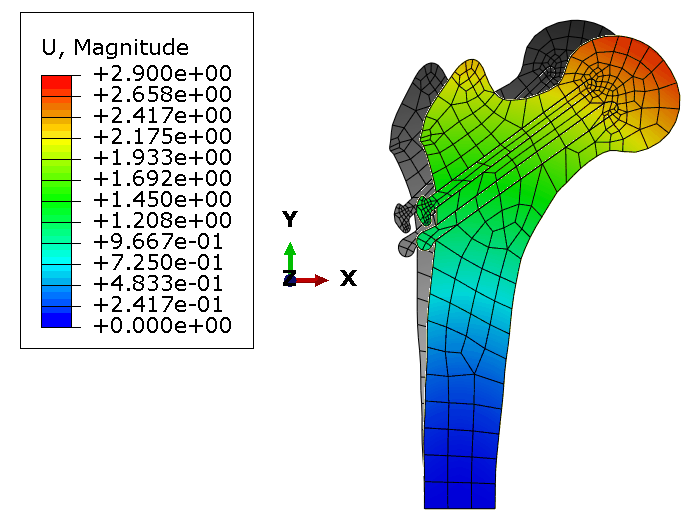

Aline Gouveia, 91594  
António Ramiro, 92796  
Miguel Fernandes, 92836

Professor João Folgado  
Professor Carlos Quental

Engenharia Biomédica

2020/2021

1.  RESUMO
    ======
    

Modelou-se com elementos finitos um fêmur e respectivas próteses através do software Abaqus, versão de estudante, tendo sido feita uma análise de convergência preliminar para encontrar o tipo de elementos usados para formar a malha mais adequada, que se mostrou ser elementos quadrilaterais e usando uma ordem de interpolação quadrática, uma vez que convergiu mais rapidamente. Fez-se, com esta malha, um estudo dos campos de tensões e de deslocamentos numa situação de carga que simula subir escadas. Este estudo foi feito para duas configurações diferentes, fémur com e sem próteses.

Exploraram-se, por fim, diferentes tipos de materiais, alterando o módulo de Young ou de elasticidade dado, E = 210 GPa, que seria de um material como aço macio, para um material com um módulo de Young mais próximo do osso cortical como o titânio, com módulo de Young E = 110 GPa.

2.  INTRODUÇÃO
    ==========
    

Este trabalho tem como objetivo analisar os estados de tensão e distorção aplicados num corpo, neste caso, um fémur, quando a este se encontram associados dois parafusos canulados de aço (módulo de Young E = 210 GPa e coeficiente de Poisson ν = 0.3).

Os parafusos canulados estudados neste trabalho são usados para estabilizar fraturas na cabeça ou colo do fémur. [\[1\]](#ref_mio) Este tipo de fratura é normalmente fruto de uma conjunção de fatores, nomeadamente da presença de ossos com características mecânicas enfraquecidas e de trauma, como quedas na população idosa e acidentes de viação, em camadas mais juvenis.[\[2\]](#ref_partirossos)

Para simular a ação das próteses anteriormente mencionadas, o software recorre ao Método de Elementos Finitos, um método numérico de resolução de equações diferenciais. Para tal, o objeto é discretizado numa malha de elementos finitos, sendo que cada um destes é constituído por um subconjunto das equações do problema original. De seguida, conjugam-se todas as equações num sistema global, que é resolúvel com base nas condições iniciais.

3.  METODOLOGIA
    ===========
    

Antes de proceder às análises, foi primeiro necessário criar um sketch das peças no software de modelação Abaqus. Foram criadas peças separadas para o fêmur e cada uma das próteses, tendo como base a [Figura 1](#fig_ossoeprot):

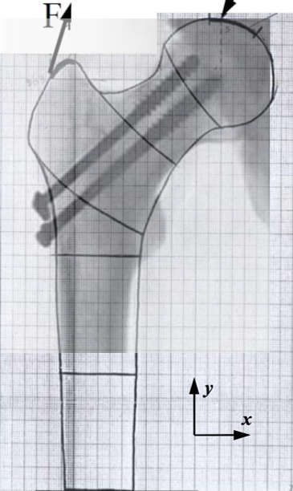

[Figura 1 —](#figur_ossoeprot) Desenho utilizado para a criação das diferentes peças no Abaqus

Posteriormente, foi feito um corte (cut) no osso na região que abriga as próteses. As peças foram então unidas por um merge, resultando em uma única peça com diferentes regiões com diferentes materiais: osso (módulo de Young E = 17 GPa e coeficiente de Poisson 𝝂 = 0.3) e prótese (E = 210 GPa e 𝝂 = 0.3). É ainda importante mencionar que se considerou uma espessura de 30 mm para o modelo plano do osso e das próteses, uma aproximação da espessura do fémur.

Aos modelos foram adicionadas as duas forças  e . As forças foram adicionadas de forma distribuída, nas redondezas dos pontos de aplicação. Além disso, a base do osso foi fixada através de um encastramento.

Para o estudo de convergência foi apenas considerada a configuração do fémur sem próteses e foram escolhidos 4 pontos do fêmur. O osso foi então submetido a simulações com os diferentes tipos de malha disponíveis: quadrangular com interpolação linear, quadrangular com interpolação quadrática, triangular com interpolação linear e triangular com interpolação quadrática.  Para cada uma das malhas, foi feita uma série de simulações com elementos de tamanhos decrescentes, até que fosse atingido o limite de 1000 nós imposto pela versão Student do software. Para os elementos quadrilaterais foi utilizado o algoritmo Advanced Front, uma vez que o método Medial Axis necessitaria que fossem criadas partições no domínio. Os resultados desta análise podem ser consultados na seção 4.a).

Uma vez escolhido o melhor tipo de elemento de malha de acordo com os resultados da análise de convergência, foram feitas simulações com o osso na presença e na ausência das próteses. Os resultados das tensões e deslocamentos nas duas situações podem ser consultados na Secção 4.b..

4.  RESULTADOS E DISCUSSÃO
    ======================
    

1.   ANÁLISE DE CONVERGÊNCIA
    ------------------------
    

De forma a poder conduzir os diversos testes necessários para compreender a influência das próteses apresentadas, é fundamental proceder primeiro a uma análise de convergência, para comparar as diferentes opções de malhas. Através desta, conhecer-se-á experimentalmente qual o número de nós e o método ideal para malhar, em função do volume de processamento computacional.

Em geral, sabe-se que as tensões de von Mises convergem mais lentamente que o deslocamento, pelo que não seria suficiente estudar a convergência do deslocamento para tirar conclusões acerca das malhas [\[3\]](#ref_conv1). Portanto, para proceder a esta análise, foram escolhidas  como variáveis de estudo tanto a tensão de von Mises, como a magnitude do deslocamento. A tensão em causa representa o limite mínimo, a partir do qual um material se comporta plasticamente [\[4\]](#ref_mises) .

De seguida, foram escolhidos quatro nós em posições que consideramos representativas, como indicado na  [figura 2](#fig_nosconvergencia), por terem a posteriori uma variação de tensão significativa.

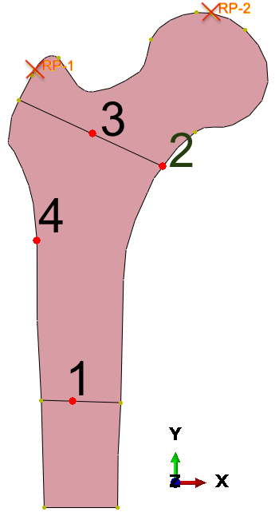

[Figura 2 —](#figur_nosconvergencia)  Nós usados para análise de convergência

Assim, mostram-se de seguida simulações variando o número de nós, o tipo dos elementos da malha (triangulares e quadrangulares) e o método de interpolação (ordem linear e quadrática), sempre feitas sem integração reduzida nos nós quadrilaterais. Nas figuras que seguem são apresentados os resultados dos estudos de convergência para cada nó escolhido para análise, com malhas de elementos quadrangulares lineares (azul), quadrangulares quadráticos (vermelho), triangulares lineares (amarelo) e triangulares quadráticos (verde).

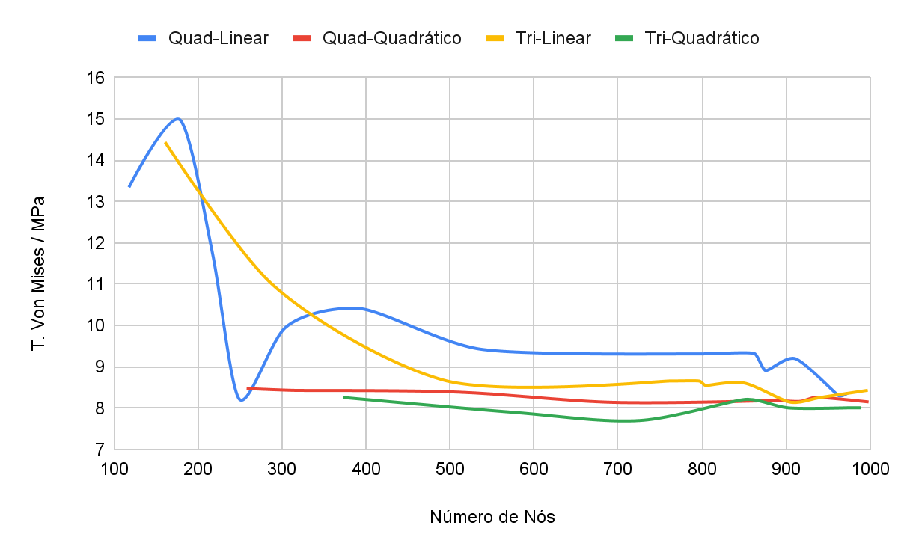

[Figura 3 —](#figur_convgS1) Análise de convergência da tensão de von Mises no nó 1

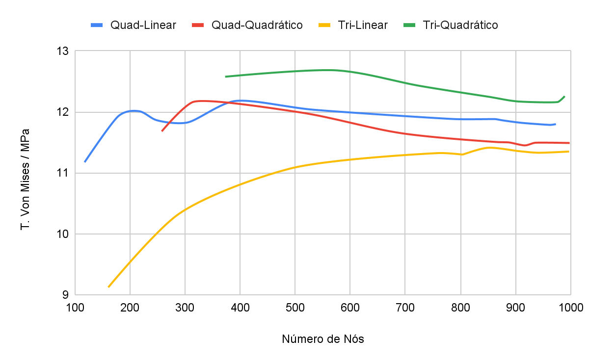

[Figura 4 —](#figur_convgS2) Análise de convergência da tensão de von Mises no nó 2

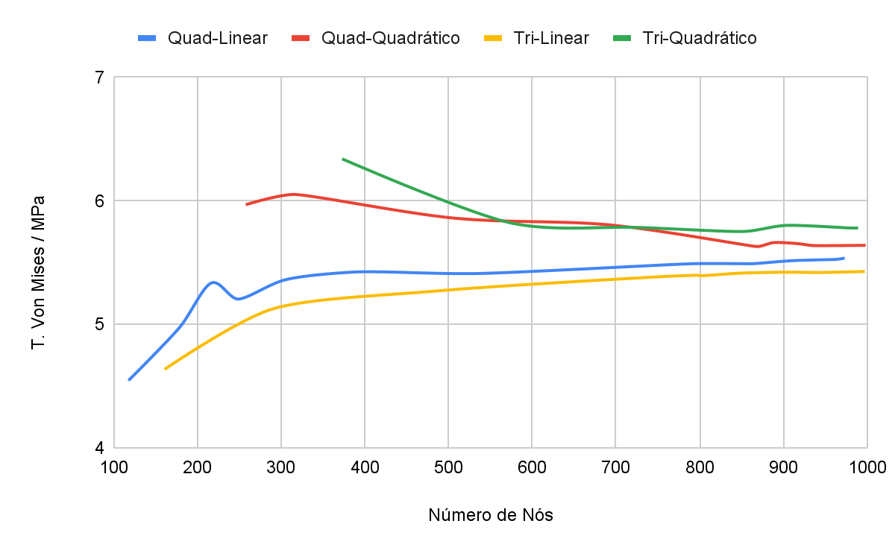

[Figura 5 —](#figur_convgS3) Análise de convergência da tensão de von Mises no nó 3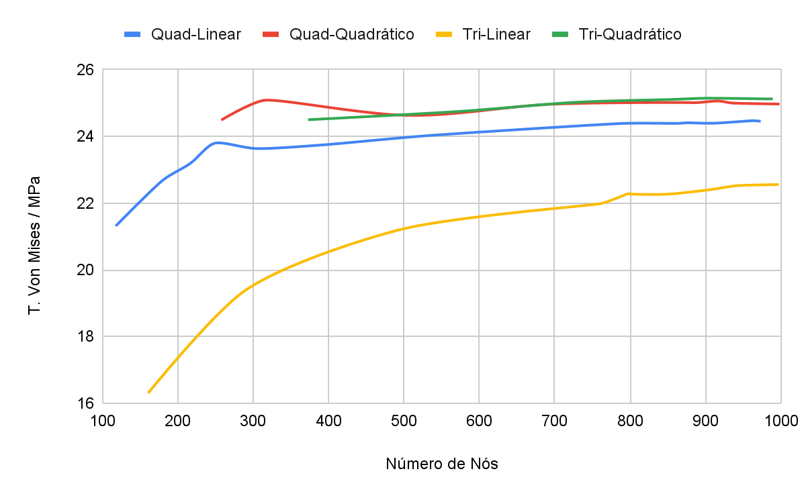

[Figura 6 —](#figur_convgS4) Análise de convergência da tensão de von Mises no nó 4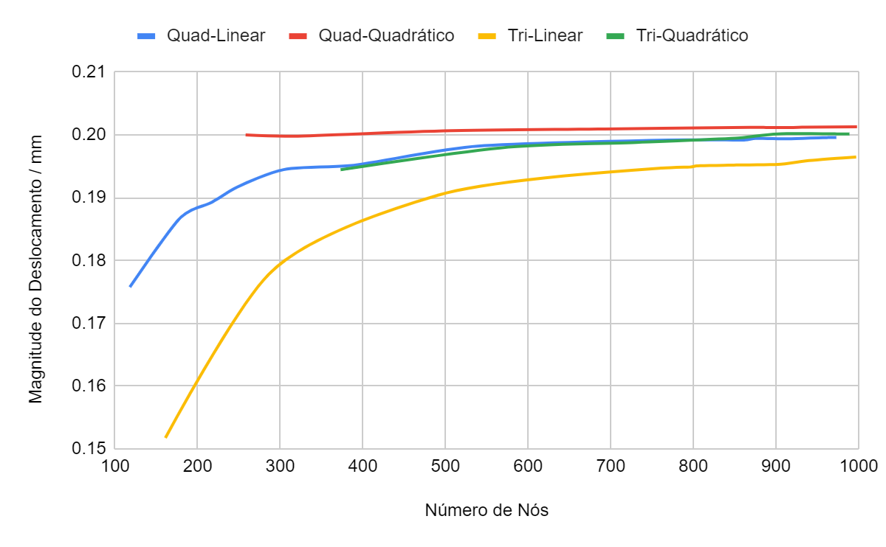

[Figura 7 —](#figur_convgU1)  Análise de convergência da magnitude do deslocamento no nó 1

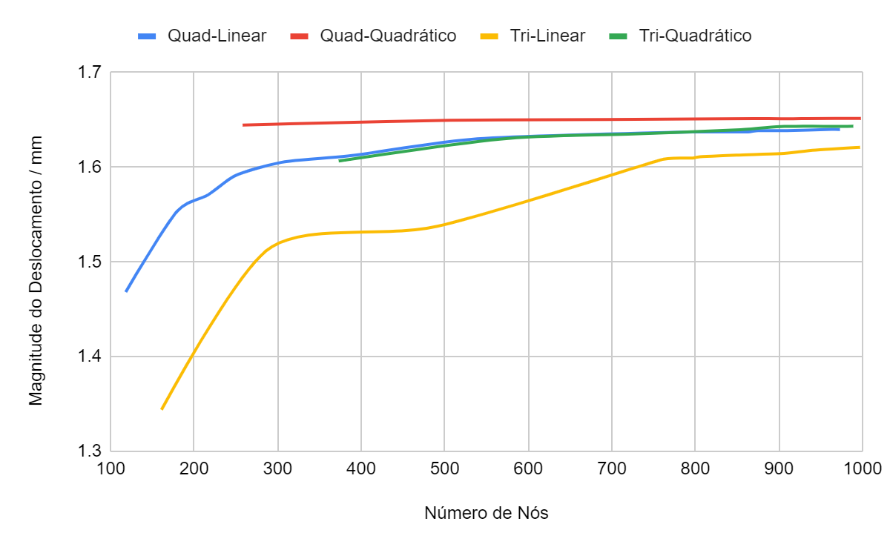

[Figura 8 —](#figur_convgU2) Análise de convergência da magnitude do deslocamento no nó 2

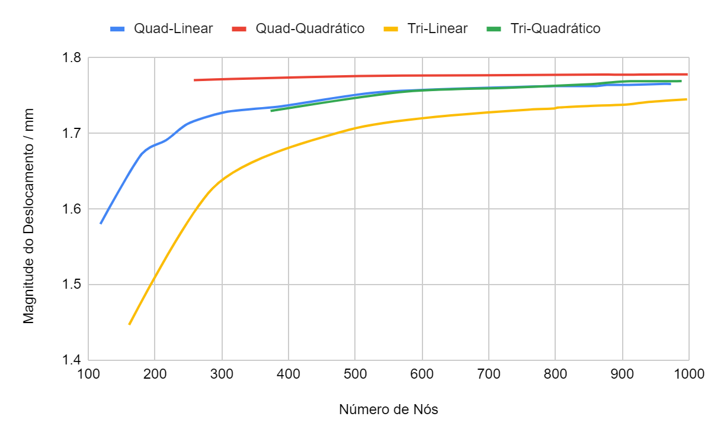

[Figura 9 —](#figur_convgU3) Análise de convergência da magnitude do deslocamento no nó 3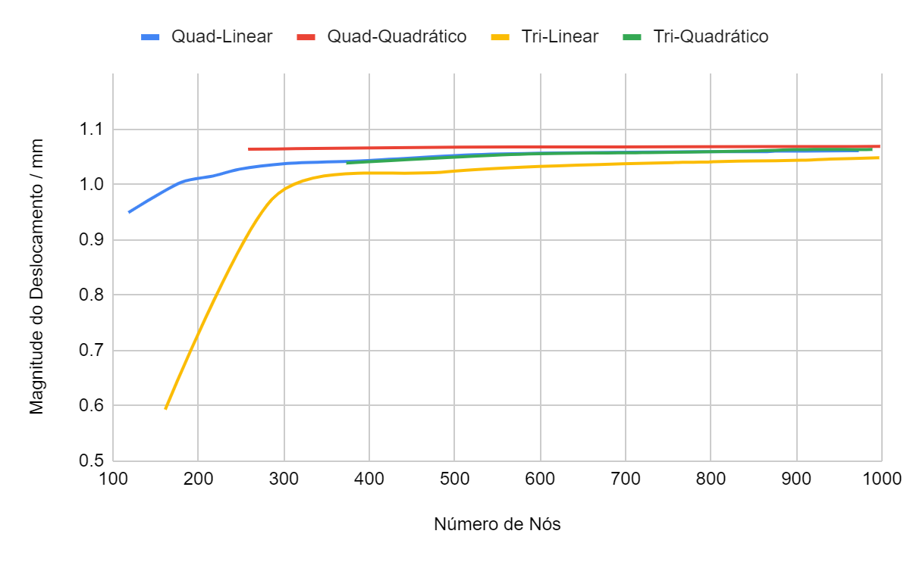

[Figura 10 —](#figur_convgU4) Análise de convergência da magnitude do deslocamento no nó 4

Através da análise da [figura 3](#fig_convgS1) à [Figura 6](#fig_convgS4), referentes à tensão de von Mises, que converge mais lentamente que os deslocamentos, é possível concluir que a malha com elementos quadrados e interpolação quadrática (linha vermelha) converge mais rapidamente do que as outras. É possível concluí-lo uma vez que, em comparação com os outros métodos, os elementos quadrados com interpolação quadrática necessitam de menos nós para chegar ao valor para o qual as simulações estão a convergir, o que significa que, com menos poder de processamento, consegue desde logo melhores resultados. Este comportamento verificou-se para todas as tensões de von Mises, destacando que as que mais demoraram para convergir foram as simulações com elementos triangulares, com interpolação linear.

Pelos gráficos que ilustram a magnitude do deslocamento em cada nó ([figura 7](#fig_convgU1) a [Figura 10](#fig_convgU4)), a conclusão anterior é corroborada, tendo ainda em conta que esta métrica converge mais rápido que a anterior e, entre todos os métodos, aprecia-se maior exatidão de uma forma geral.

Assim, tem-se que, no seguimento do presente trabalho, se utilizou uma malha com elementos quadrados com interpolação quadrática.

2.  ESTUDO DA INFLUÊNCIA DA PRÓTESE
    -------------------------------
    

1.  ###  MALHA
    

Com base na análise de convergência feita, foi feito um estudo utilizando elementos do tipo quadrangular quadrático com um número de nós próximo do limite imposto pela versão de estudante do Abaqus (1000 nós). As malhas resultantes para os dois casos, com e sem próteses, encontram-se ilustrada na [Figura 11](#fig_malha).

Por conta da geometria das próteses, o software distribui os elementos de forma diferente, fazendo com que sejam criados elementos menores no interior dos implantes e nas zonas do osso imediatamente em contacto com os mesmos. Como resultado, as restantes zonas do osso têm elementos maiores, o que pode afetar os resultados obtidos pelo método dos elementos finitos.

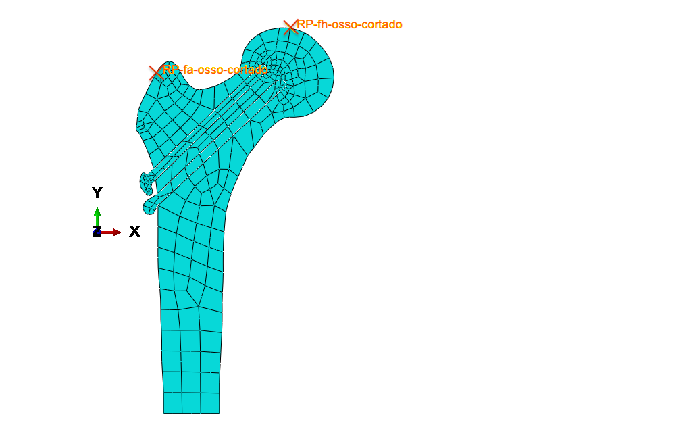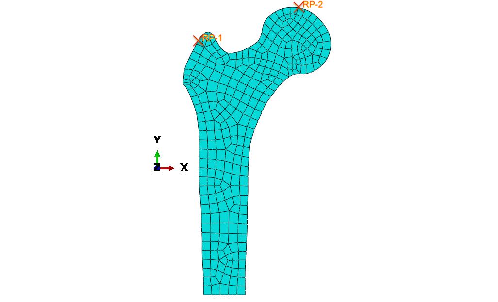

[Figura 11 —](#figur_malha) Malha de elementos finitos para o osso e para o osso com próteses. Os pontos RP são reference points e são usados para distribuir as forças em superfícies.

Apresentamos de seguida a distribuição de tensões e deslocamentos para os dois casos, com e sem implante.

2.  ###  DESLOCAMENTOS
    

Começando pelos deslocamentos, que se encontram representados com uma escala de cores na configuração original. 

Apresentamos de seguida a magnitude dos deslocamentos e, uma vez que se trata de uma modelação plana, o valor dos deslocamentos segundo as duas direções 1 (ou xx) e 2 (ou yy).

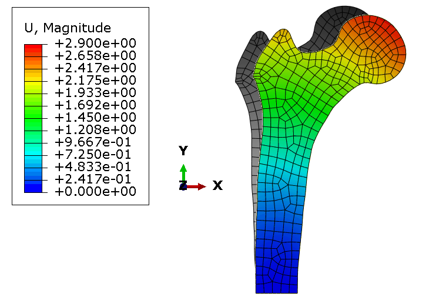

[Figura 12 —](#figur_magU)  Análise da magnitude dos deslocamentos nas situações sem e com implantes, respectivamente.

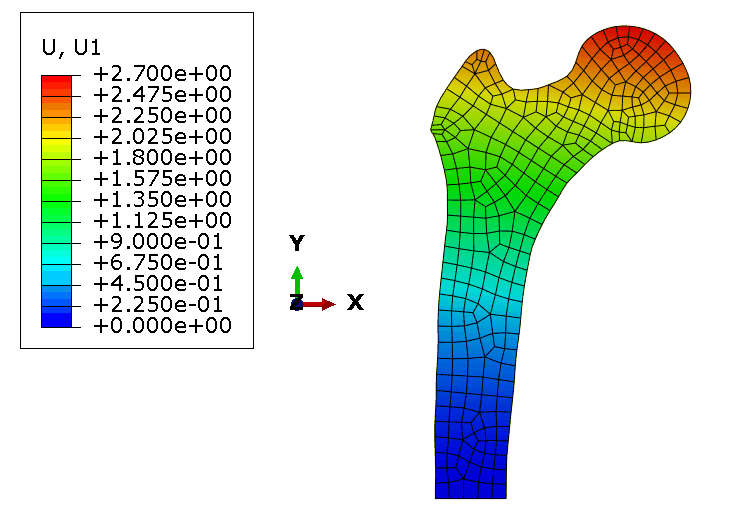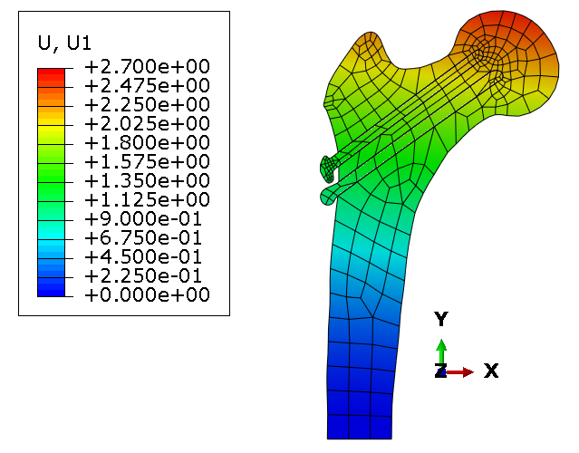

[Figura 13 —](#figur_magU1)  Análise dos deslocamentos segundo x nas situações sem e com implantes, respectivamente.

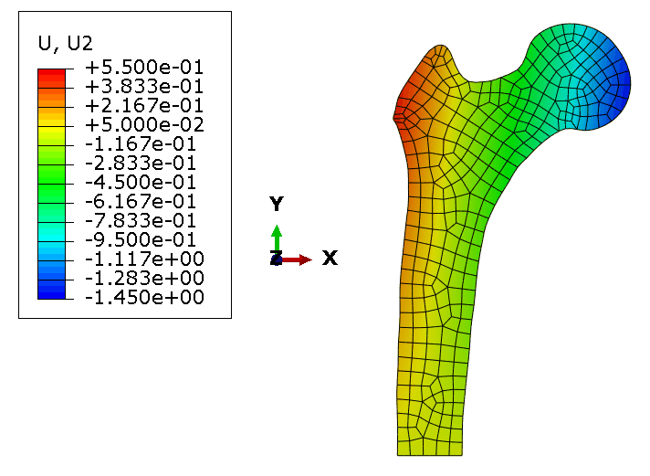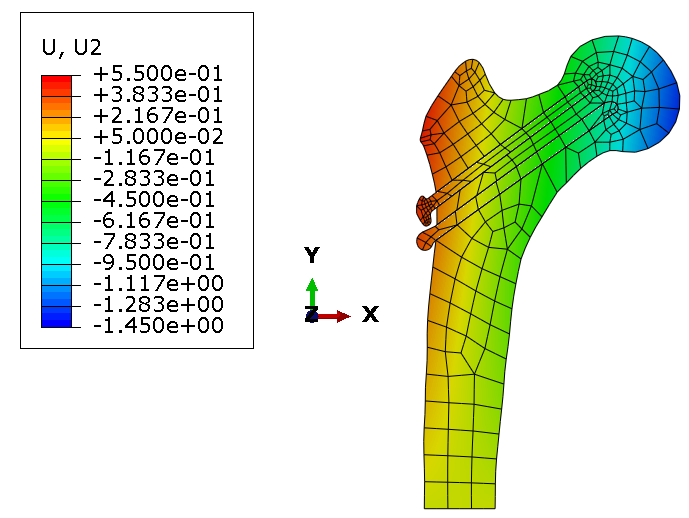

[Figura 14 —](#figur_magU2)  Análise dos deslocamentos segundo y nas situações sem e com implantes, respectivamente.

A partir das figuras acima conclui-se, em primeiro lugar, que a magnitude dos deslocamentos decresce à medida que nos afastamos da zona de aplicação das forças e nos aproximamos da zona de encastre, onde são necessariamente nulos.

Além disto, os deslocamentos segundo a direção 1 são maiores na parte superior do osso e os deslocamentos segundo a direção 2 são maiores na parte lateral esquerda do osso. As forças aplicadas provocam um momento negativo segundo o eixo z na parte superior do osso, resultando em maiores distorções nos pontos do corpo situados a uma maior distância do centro de curvatura.

Finalmente, concluímos que as próteses não afetam de forma significativa o campo de deslocamentos causado pela ação das forças consideradas.

3.   TENSÕES
    --------
    

As tensões encontram-se representadas também com uma escala de cores na configuração deformada, com as deformações da imagem ampliadas por um fator de 95 e com a configuração original por trás, numa escala de cinzentos, para o caso da magnitude dos deslocamentos.

Nesta análise apresentamos os resultados para diferentes medidas: critério de von Mises, tensões segundo a direção 1 (S11), tensões segundo a direção 2 (S22) e tensões tangenciais em relação às facetas com normais orientadas segundo 1 e 2 (S12).

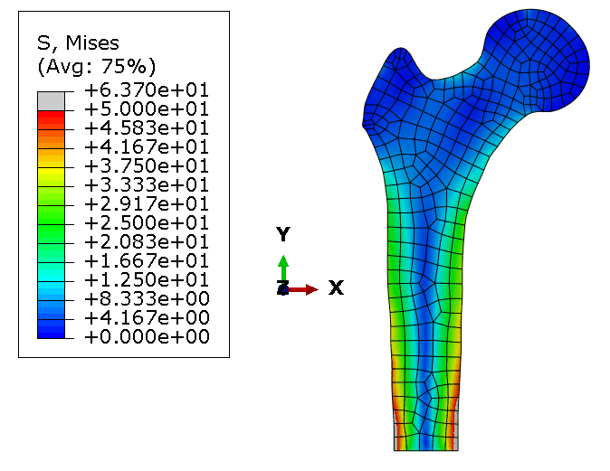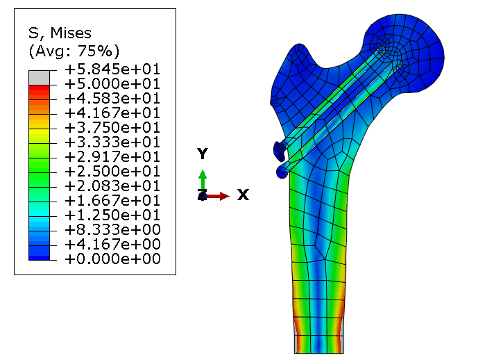

[Figura 15 —](#figur_mises)  Análise do critério de von Mises nas situações sem e com implantes, respectivamente.

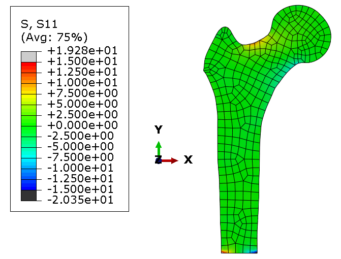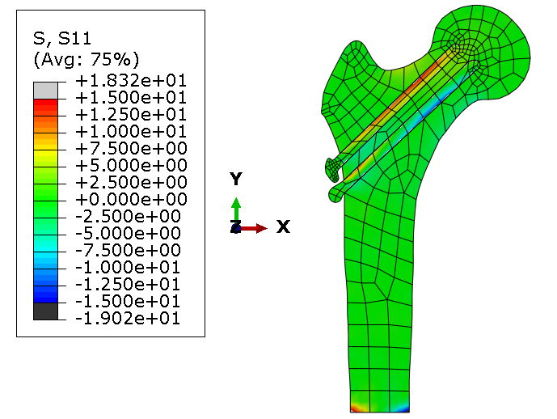

[Figura 16 —](#figur_s11)  Análise da tensão segundo x nas situações sem e com implantes, respectivamente.  

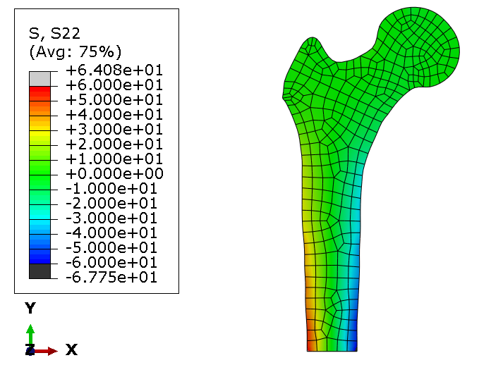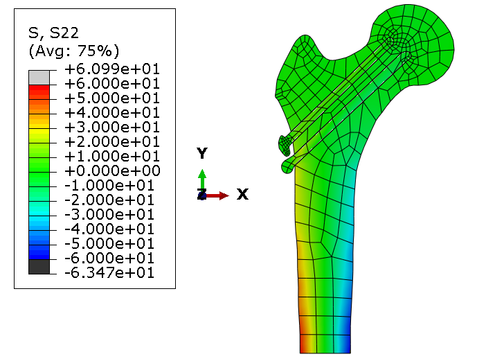

[Figura 17 —](#figur_s22)  Análise da tensão segundo y nas situações sem e com implantes, respectivamente.

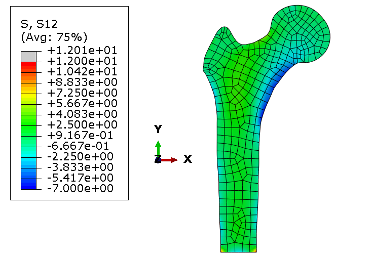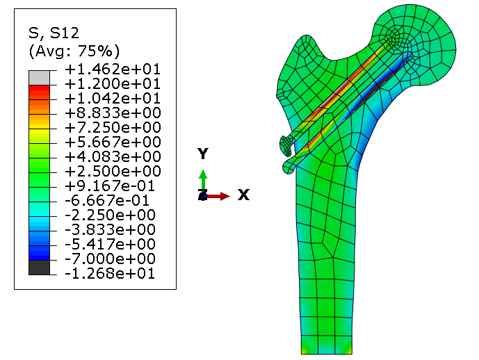[Figura 18 —](#figur_s12)  Análise da tensão tangencial nas situações sem e com implantes, respectivamente.

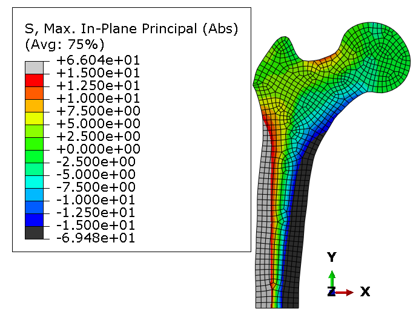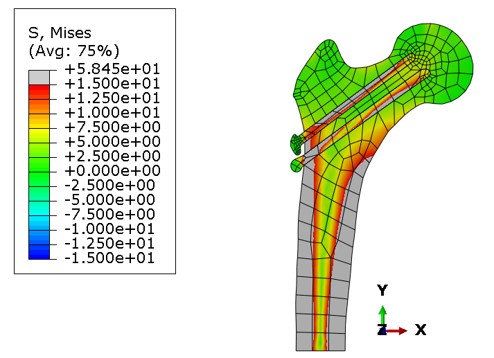

[Figura 19 —](#figur_smaxabs15) Análise da tensão máxima principal absoluta nas situações sem e com implantes, respectivamente, com escala de forma a analisar a cabeça do fémur

O fémur é o maior osso do corpo humano e, por isso, é também o melhor candidato para ser aproximado através de um modelo de uma viga. Estes resultados corroboram esta hipótese, uma vez que verificamos que as tensões são mais significativas na direção yy. Isto também pode ser verificado na x e x, onde vemos que os deslocamentos na direção yy são muito diminutos relativos aos deslocamentos na direção xx  (55/2.65 = 21). A melhor forma de representar um fémur é através de um modelo tridimensional contínuo e a segunda melhor forma é através de um modelo de uma viga com secção transversal variável [\[6\]](#ref_luo) Assim, conclui-se que os deslocamentos segundo yy podem ser desprezados sem grandes erros associados.

Além disso, ambas as tensões nas direções 1 e 2 foram inferiores no osso com prótese. No entanto, foram superiores na direção 12.

Por outro lado, verificamos em S12 uma zona de menores tensões do lado direito do osso.

É possível observar também que todas as tensões são mais altas na prótese superior do que na inferior. Este fenômeno está relacionado com a proximidade das próteses às zonas de aplicação das forças ser desigual, sujeitando o implante superior a maiores tensões.

Por outro lado, constata-se um efeito de stress shielding apenas na zona do colo do fêmur na [Figura 19](#fig_smaxabs15). Nesta região, há uma diminuição das tensões por consequência da inserção dos implantes, o que pode acarretar em desmineralização óssea. Como observamos nas imagens, as tensões nas outras zonas do osso não sofrem grandes variações entre as duas situações.

4.   TENSÕES E DIREÇÕES PRINCIPAIS
    ------------------------------
    

As tensões principais de tensão correspondem às tensões normais segundo as direções principais de tensão, em que as tensões tangenciais são nulas.

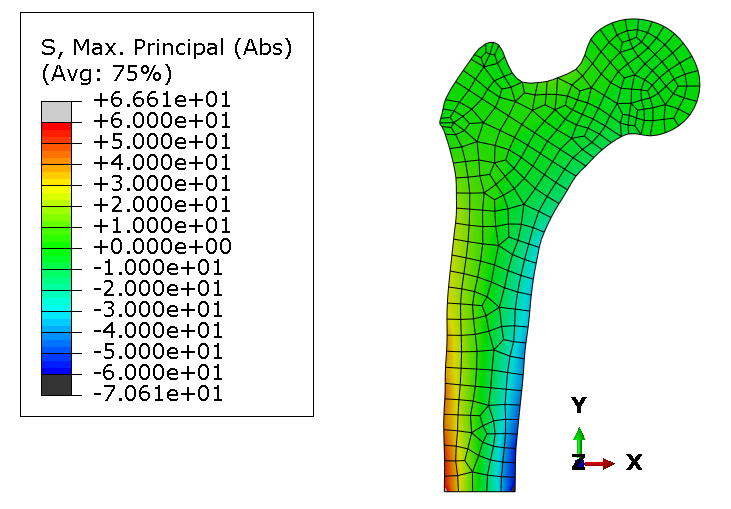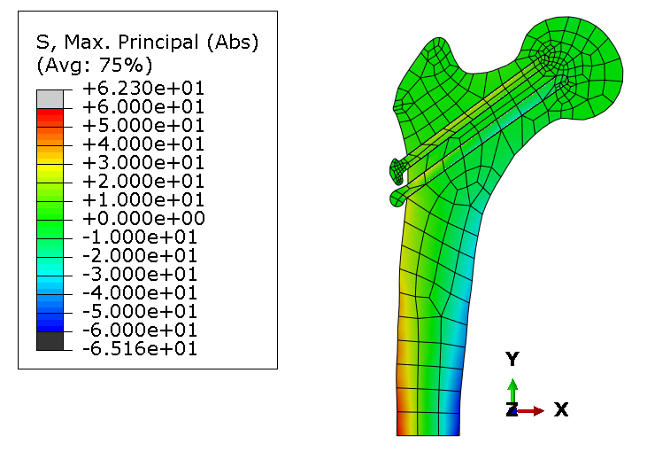

[Figura 20 —](#figur_smaxabs) Análise da tensão máxima principal absoluta nas situações sem e com implantes, respectivamente

O valor tensão máxima principal (absoluto) corresponde à tensão principal em cada ponto que tem maior valor absoluto, ou seja, maior magnitude. Esta é uma medida útil pois permite fazer uma análise global da nossa estrutura. Da observação dos resultados apresentados na [figura 20](#fig_smaxabs) e tendo em foco a zona da diáfise, podemos dizer que no lado esquerdo a tensão dominante é de tração e no lado direito a tensão dominante é de compressão.

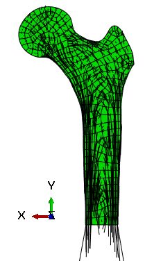

[Figura 21 —](#figur_direcoes) Análise das direções principais de tensão

A partir da [figura 21](#fig_direcoes) podemos analisar a distribuição das direções principais de tensão. No osso, é esperado que as trabéculas tenham uma disposição semelhante às direções principais de tensão, diminuindo a propensão de ocorrer rompimento. De facto, esta relação pode ser observada ao compararmos as direções principais de tensão com a disposição trabecular do fêmur ([figura 22](#fig_trabeculas)).

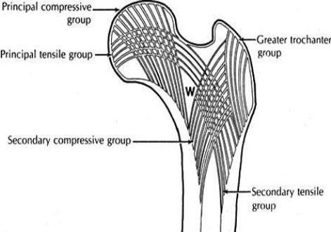

[Figura 22 —](#figur_trabeculas)  Disposição trabecular do fêmur

5\. CONCLUSÕES
==============

No presente trabalho, tivemos a oportunidade de trabalhar com um software de modelação que faz uso do método de elementos finitos, leccionado na unidade curricular de Mecânica e Modelação Computacional. Conseguimos compreender a necessidade e o contexto em que se aplicam as suas potencialidades, nomeadamente no campo da medicina.

Verificámos que a opção que convergiu mais rapidamente foi a que incluía elementos quadrangulares com interpolação de ordem quadrática, resultado que tinha sido antecipado pelos conhecimentos que adquirimos nas aulas.

A análise das tensões e deslocamentos no fêmur permitiu uma aplicação biomecânica dos conhecimentos de elementos finitos. Este estudo teve em conta uma série de aproximações como a disposição plana do osso, uma espessura e constituições constantes, além de ter sido considerado apenas a parte superior do mesmo. No entanto, os métodos utilizados foram bem sucedidos em apresentar uma visão geral dos fenômenos que ocorrem rotineiramente no corpo humano, com especial foco ao movimento de subir escadas.  

Com base nas simulações de tensão e deslocamento, verificou-se que os resultados obtidos na presença dos implantes são semelhantes àqueles encontrados na sua ausência. Por isso, conclui-se que as próteses utilizadas servem bem a sua função de restituir o estado inicial do osso sem gerar efeitos indesejados.

6\. REFERÊNCIAS
===============

[\[1\] —](#refer_mio)  Ernst Raaymakers, Inger Schipper, Rogier Simmermacher, Chris van der Werken. AO Surgery Reference: MIO — Cancellous screws for Femoral neck fracture, subcapital, displaced,, [surgeryreference.aofoundation.org](https://www.google.com/url?q=https://surgeryreference.aofoundation.org/orthopedic-trauma/adult-trauma/proximal-femur/femoral-neck-fracture-subcapital-displaced/mio-cancellous-screws&sa=D&source=editors&ust=1653408082760795&usg=AOvVaw2LQ6A1lqx2e3HRczJe0Jtq) consultado a 01/06/2021

[\[2\] —](#refer_partirossos)  Dr. Daniel J Bell, Frank Gaillard et al., Femoral neck fracture, Radiopaedia, consultado em [radiopaedia.org](https://www.google.com/url?q=https://radiopaedia.org/articles/femoral-neck-fracture&sa=D&source=editors&ust=1653408082761510&usg=AOvVaw0KRlApbFjsyKwf4q5iL7vf) a 4 de Junho de 2021

[\[3\] —](#refer_conv1)  Universidade de Alberta, Canadá. FEM Convergence Testing, consultado em [sites.ualberta.ca](https://www.google.com/url?q=https://sites.ualberta.ca/~wmoussa/AnsysTutorial/AU/Converge/Converge.html&sa=D&source=editors&ust=1653408082762243&usg=AOvVaw3rKfKoeQhnUWgw-V934nGg) a 4 de Junho de 2021

[\[4\] —](#refer_mises)  Bob McGinty, Von Mises Stress, [www.continuummechanics.org](https://www.google.com/url?q=https://www.continuummechanics.org/vonmisesstress.html&sa=D&source=editors&ust=1653408082762655&usg=AOvVaw3xHjdCQPUEfvSJdLpI91E2) consultado a 6 de Junho de 2021

[\[5\] —](#refer_imperial) [Alice Younge,](https://www.google.com/url?q=https://slideplayer.com/slide/5928172/&sa=D&source=editors&ust=1653408082763157&usg=AOvVaw3LQ1dm3AOtg2m18oBOX3HB) [Structural Analysis of the Femur: A Collaborative Tool for Surgeons and Engineers](https://www.google.com/url?q=https://slideplayer.com/slide/5928172/&sa=D&source=editors&ust=1653408082763391&usg=AOvVaw0BK2qMEw-mSKr4vSNecOyc)

[\[6\] —](#refer_luo)  Luo Y., Finite Element Modeling of Femur Stresses/Strains Induced by Impact Force in Image-Based Multilevel Biomechanical Modeling for Fall-Induced Hip Fracture, 2017 Springer, Cham [https://doi.org/10.1007/978-3-319-51671-4\_8](https://www.google.com/url?q=https://doi.org/10.1007/978-3-319-51671-4_8&sa=D&source=editors&ust=1653408082764453&usg=AOvVaw1FE5E-CsfOxB-duiOKfvNj)